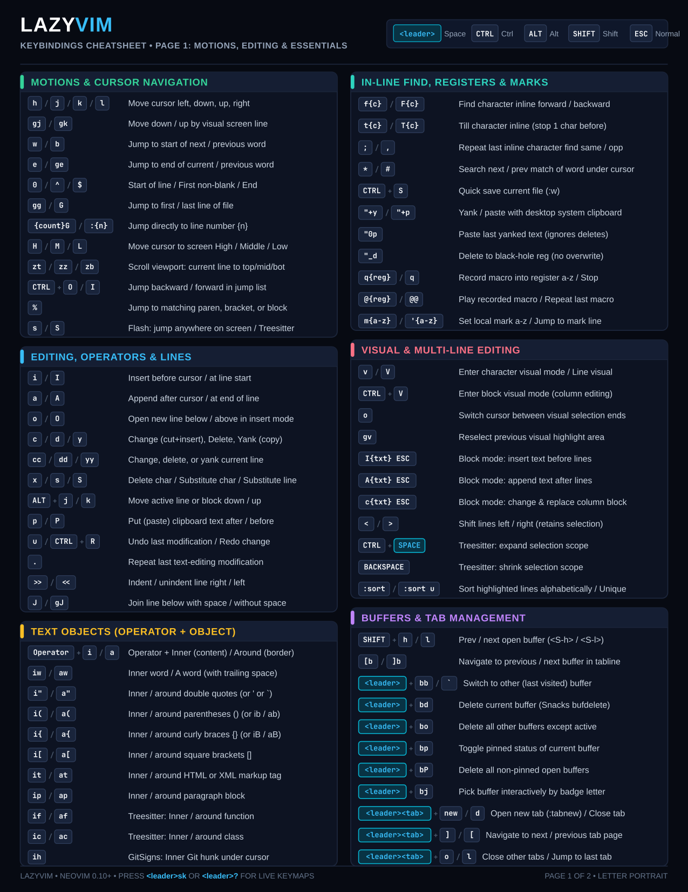
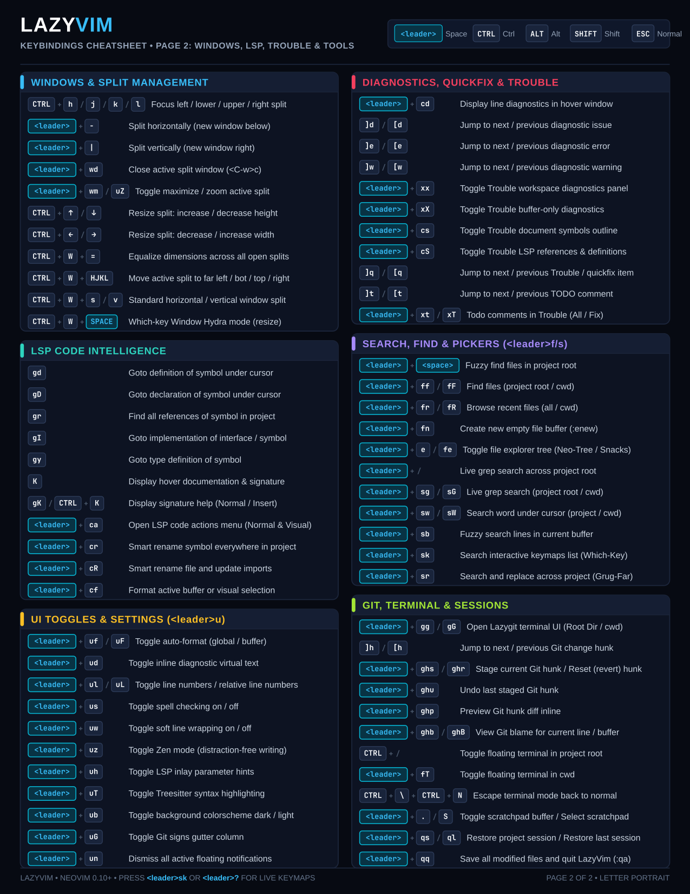
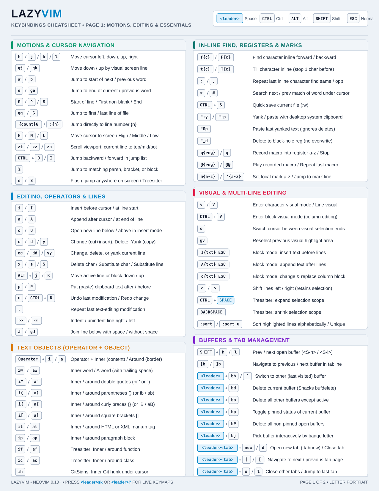
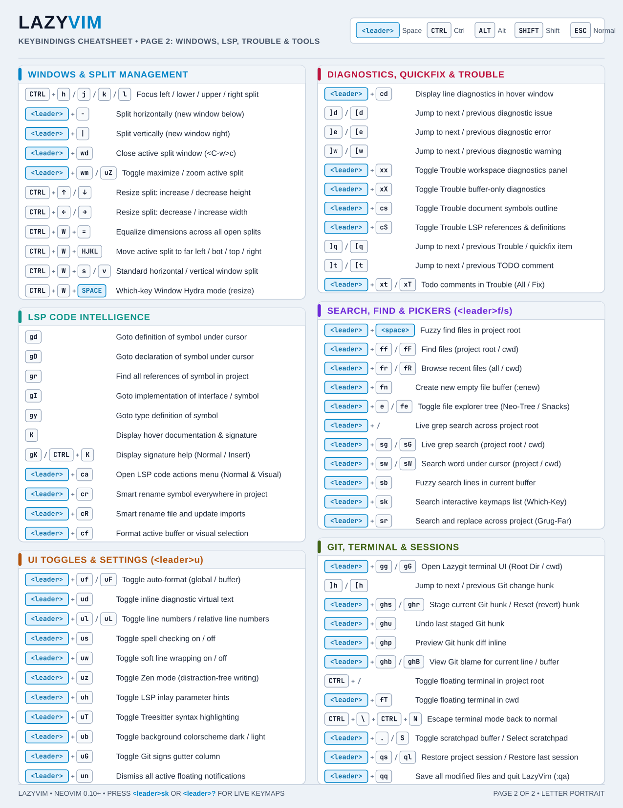
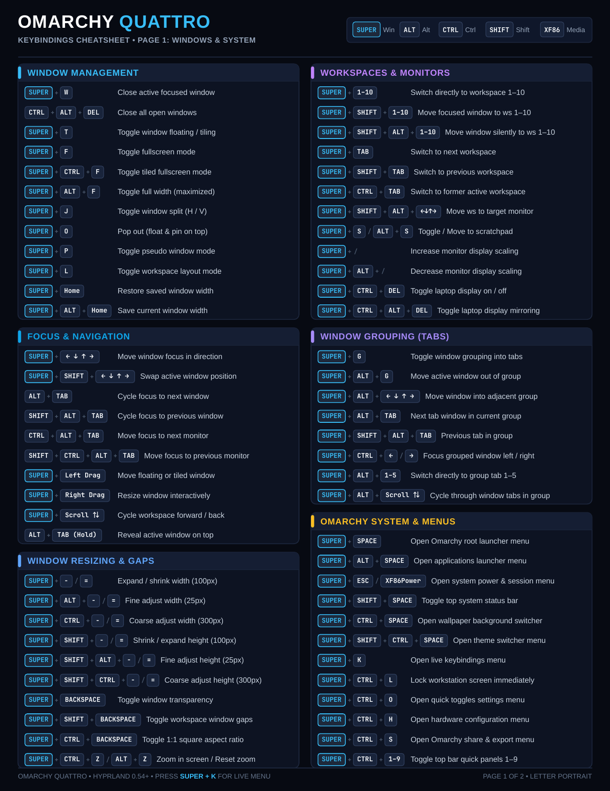
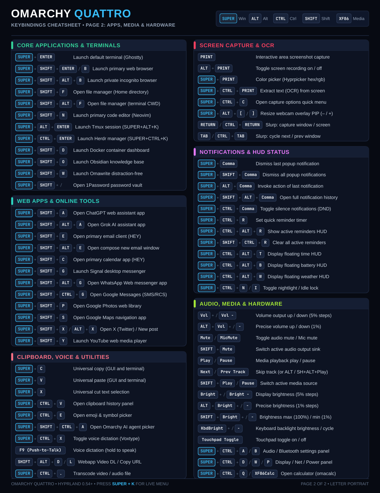
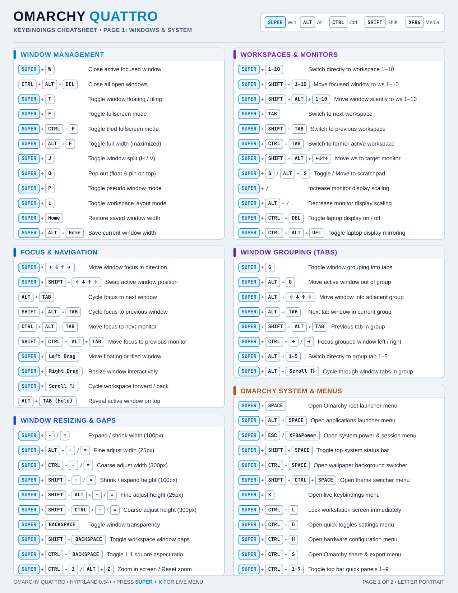
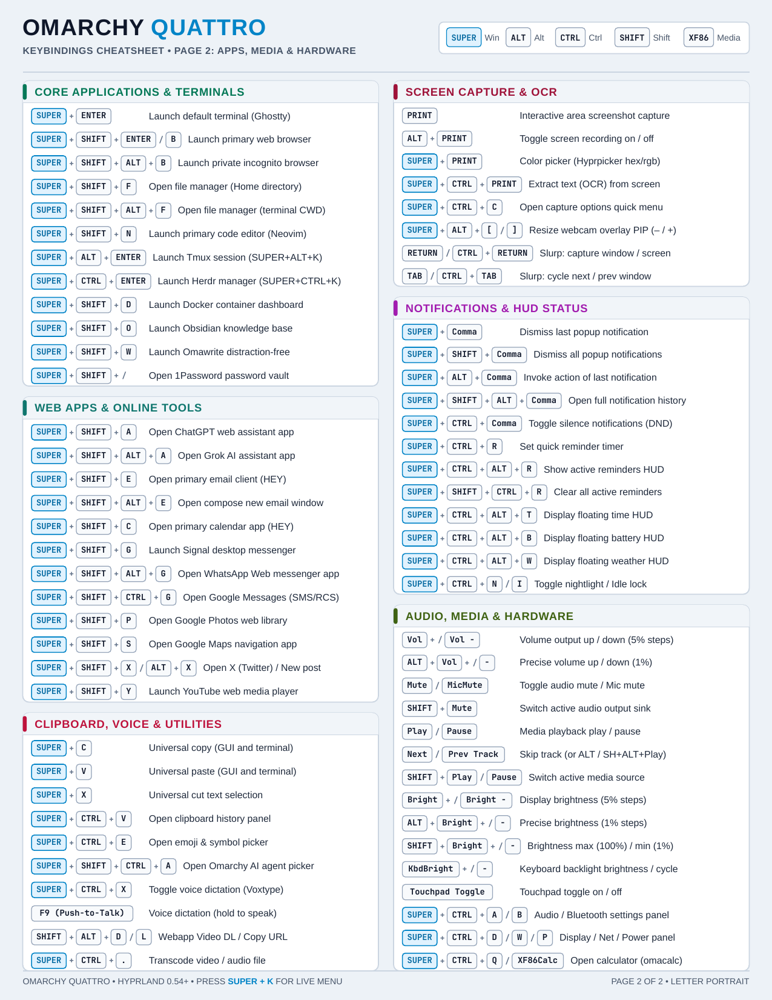

# Printable Cheatsheets (US Letter Portrait, 8.5 × 11 in)

High-contrast, printable 2-page cheatsheets (Letter Portrait, 8.5 × 11 in) designed for rapid reference, daily muscle memory, and printing (back and front).

Available in both digital **Dark Theme** and ink-friendly **Light / Print Theme**.

---

## 1. LazyVim Modern Neovim Cheatsheet

A complete 2-page cheatsheet for **[LazyVim](https://lazyvim.org)** (Neovim 0.10+) covering core motions, precision editing, text objects, in-line search, registers/macros, buffers, splits, LSP code intelligence, UI toggles (`<leader>u`), Trouble diagnostics, Snacks/Telescope pickers, Git/Lazygit, and terminal workflows.

### Previews

#### Dark Theme
| Page 1: Motions, Editing & Essentials | Page 2: Windows, LSP, Trouble & Tools |
| :---: | :---: |
|  |  |

#### Light Theme (Print-Ready)
| Page 1: Motions, Editing & Essentials | Page 2: Windows, LSP, Trouble & Tools |
| :---: | :---: |
|  |  |

### Downloads (PDF & SVG)

| Document | Format | Description |
| :--- | :--- | :--- |
| [**`lazyvim-cheatsheet.pdf`**](lazyvim-cheatsheet.pdf) | PDF (2 Pages) | Default 2-page cheatsheet (Dark theme, 8.5 × 11 in) |
| [**`lazyvim-cheatsheet-light.pdf`**](lazyvim-cheatsheet-light.pdf) | PDF (2 Pages) | High-contrast, ink-friendly 2-page cheatsheet for printing |
| [**`lazyvim-cheatsheet-dark.pdf`**](lazyvim-cheatsheet-dark.pdf) | PDF (2 Pages) | High-contrast dark theme 2-page cheatsheet |
| [**`lazyvim-cheatsheet-p1.pdf`**](lazyvim-cheatsheet-p1.pdf) | PDF (1 Page) | Page 1 standalone PDF (Motions, Editing, Objects, Buffers) |
| [**`lazyvim-cheatsheet-p2.pdf`**](lazyvim-cheatsheet-p2.pdf) | PDF (1 Page) | Page 2 standalone PDF (Windows, LSP, UI Toggles, Pickers, Git) |
| [**`lazyvim-cheatsheet-p1-light.svg`**](lazyvim-cheatsheet-p1-light.svg) | SVG Source | Page 1 vector source (Light theme) |
| [**`lazyvim-cheatsheet-p2-light.svg`**](lazyvim-cheatsheet-p2-light.svg) | SVG Source | Page 2 vector source (Light theme) |
| [**`lazyvim-cheatsheet-p1-dark.svg`**](lazyvim-cheatsheet-p1-dark.svg) | SVG Source | Page 1 vector source (Dark theme) |
| [**`lazyvim-cheatsheet-p2-dark.svg`**](lazyvim-cheatsheet-p2-dark.svg) | SVG Source | Page 2 vector source (Dark theme) |

### Logical Group Overview

#### Page 1: Motions, Editing, Objects & Buffers (Front)
1. **Motions & Cursor Navigation**: Basic movement (`h/j/k/l`), visual line moves (`gj/gk`), word navigation (`w/b`, `e/ge`), line bounds (`0`, `^`, `$`), file jumps (`gg`, `G`, `{n}G`), screen viewport (`H/M/L`, `zt/zz/zb`), jump list (`CTRL+O / I`), bracket matching (`%`), and Flash screen/treesitter jumps (`s / S`).
2. **Editing, Operators & Lines**: Insert & append transitions (`i/I`, `a/A`, `o/O`), operators (`c/d/y`), whole-line operations (`cc/dd/yy`), quick edits (`x/s/S`), line moving (`ALT+j/k`), paste (`p/P`), undo/redo (`u / CTRL+R`), repeat (`.`), indenting (`>> / <<`), and line joining (`J / gJ`).
3. **Text Objects (Operator + Object)**: Operator combinations (`c/d/y + i/a`), inner/around words (`iw / aw`), quoted strings (`i" / a"`), parentheses/braces/brackets (`i( / a(`, `i{ / a{`, `i[ / a[`), XML/HTML tags (`it / at`), paragraphs (`ip / ap`), Treesitter functions & classes (`if / af`, `ic / ac`), and Git hunks (`ih`).
4. **In-Line Find, Registers & Marks**: Character find (`f{c} / F{c}`, `t{c} / T{c}`, `; / ,`), word search (`* / #`), quick save (`CTRL+S`), system clipboard (`"+y / "+p`), last yanked register (`"0p`), black-hole register (`"_d`), macro recording & replay (`q{reg} / q`, `@{reg} / @@`), and marks (`m{a-z} / '{a-z}`).
5. **Visual & Multi-Line Editing**: Visual modes (`v / V / CTRL+V`), selection boundaries (`o`), reselection (`gv`), block column editing (`I{txt} ESC`, `A{txt} ESC`, `c{txt} ESC`), visual indenting (`< / >`), Treesitter incremental selection (`CTRL+SPACE / BACKSPACE`), and sorting (`:sort / :sort u`).
6. **Buffers & Tab Management**: Buffer cycling (`SHIFT+h/l`, `[b / ]b`), switch to other buffer (`<leader>bb / <leader>\``), buffer deletion (`<leader>bd`, `<leader>bo`), pinning (`<leader>bp`, `<leader>bP`), buffer picker (`<leader>bj`), tab creation & close (`<leader><tab> + new / d`), and tab navigation (`<leader><tab> + ] / [`, `<leader><tab> + o / l`).

#### Page 2: Windows, LSP, Trouble & Tools (Back)
7. **Windows & Split Management**: Window focus (`CTRL+h/j/k/l`), horizontal/vertical splits (`<leader>-`, `<leader>|`, `CTRL+W s/v`), close window (`<leader>wd`), zoom/maximize (`<leader>wm / <leader>uZ`), resizing (`CTRL+↑/↓`, `CTRL+←/→`), equalize (`CTRL+W =`), move splits (`CTRL+W HJKL`), and Window Hydra mode (`CTRL+W SPACE`).
8. **LSP Code Intelligence**: Goto definition (`gd`), declaration (`gD`), references (`gr`), implementation (`gI`), type definition (`gy`), hover documentation (`K`), signature help (`gK / CTRL+K`), code actions (`<leader>ca`), symbol rename (`<leader>cr`), file rename (`<leader>cR`), and formatting (`<leader>cf`).
9. **UI Toggles & Settings (`<leader>u`)**: Toggle auto-format (`<leader>uf / uF`), diagnostics virtual text (`<leader>ud`), line numbers (`<leader>ul / uL`), spell check (`<leader>us`), soft wrap (`<leader>uw`), Zen mode (`<leader>uz`), inlay hints (`<leader>uh`), Treesitter (`<leader>uT`), dark/light background (`<leader>ub`), Git signs (`<leader>uG`), and dismiss notifications (`<leader>un`).
10. **Diagnostics, Quickfix & Trouble**: Floating line diagnostic (`<leader>cd`), diagnostic jumping (`]d / [d`, `]e / [e`, `]w / [w`), Trouble diagnostics panel (`<leader>xx / <leader>xX`), Trouble symbols & LSP (`<leader>cs / <leader>cS`), quickfix navigation (`]q / [q`), and Todo comments navigation & Trouble view (`]t / [t`, `<leader>xt / xT`).
11. **Search, Find & Pickers (`<leader>f / <leader>s`)**: Project find files (`<leader><space>`, `<leader>ff / fF`), recent files (`<leader>fr / fR`), new file (`<leader>fn`), file explorer tree (`<leader>e / fe`), live grep (`<leader>/`, `<leader>sg / sG`), search word under cursor (`<leader>sw / sW`), buffer lines fuzzy find (`<leader>sb`), keymaps search (`<leader>sk`), and search & replace across project (`<leader>sr` via Grug-Far).
12. **Git, Terminal & Sessions**: Lazygit terminal UI (`<leader>gg / gG`), Git hunk navigation (`]h / [h`), stage/reset hunks (`<leader>ghs / ghr`), undo stage (`<leader>ghu`), preview hunk inline (`<leader>ghp`), git blame (`<leader>ghb / ghB`), floating terminal (`CTRL+/`, `<leader>fT`), terminal escape (`CTRL+\ + CTRL+N`), scratchpad buffer (`<leader>. / S`), session restore (`<leader>qs / ql`), and quit all (`<leader>qq`).

---

## 2. Omarchy Quattro Keybindings Cheatsheet

A complete 2-page cheatsheet (Letter Portrait, 8.5 × 11 in) for **Omarchy Quattro** running on **Hyprland**.

### Previews

#### Dark Theme
| Page 1: Windows & System | Page 2: Apps, Media & Hardware |
| :---: | :---: |
|  |  |

#### Light Theme (Print-Ready)
| Page 1: Windows & System | Page 2: Apps, Media & Hardware |
| :---: | :---: |
|  |  |

### Downloads (PDF & SVG)

| Document | Format | Description |
| :--- | :--- | :--- |
| [**`omarchy-keybindings.pdf`**](omarchy-keybindings.pdf) | PDF (2 Pages) | Default 2-page cheatsheet (Dark theme, 8.5 × 11 in) |
| [**`omarchy-keybindings-light.pdf`**](omarchy-keybindings-light.pdf) | PDF (2 Pages) | High-contrast, ink-friendly 2-page cheatsheet for printing |
| [**`omarchy-keybindings-dark.pdf`**](omarchy-keybindings-dark.pdf) | PDF (2 Pages) | High-contrast dark theme 2-page cheatsheet |
| [**`omarchy-keybindings-p1.pdf`**](omarchy-keybindings-p1.pdf) | PDF (1 Page) | Page 1 standalone PDF (Windows, Workspaces & System) |
| [**`omarchy-keybindings-p2.pdf`**](omarchy-keybindings-p2.pdf) | PDF (1 Page) | Page 2 standalone PDF (Apps, Capture & Hardware) |
| [**`omarchy-keybindings-p1-light.svg`**](omarchy-keybindings-p1-light.svg) | SVG Source | Page 1 vector source (Light theme) |
| [**`omarchy-keybindings-p2-light.svg`**](omarchy-keybindings-p2-light.svg) | SVG Source | Page 2 vector source (Light theme) |
| [**`omarchy-keybindings-p1-dark.svg`**](omarchy-keybindings-p1-dark.svg) | SVG Source | Page 1 vector source (Dark theme) |
| [**`omarchy-keybindings-p2-dark.svg`**](omarchy-keybindings-p2-dark.svg) | SVG Source | Page 2 vector source (Dark theme) |

---

## Regenerating Sheets

All cheatsheets are generated programmatically via Python and rendered to PDF & high-resolution PNG using `rsvg-convert`:

```bash
# Requirements: python3, rsvg-convert (librsvg)

# Generate LazyVim cheatsheet (SVGs, 2-page PDFs, and PNG previews)
python3 generate_lazyvim_cheatsheet.py

# Generate Omarchy Quattro cheatsheet
python3 generate_cheatsheet.py
```
